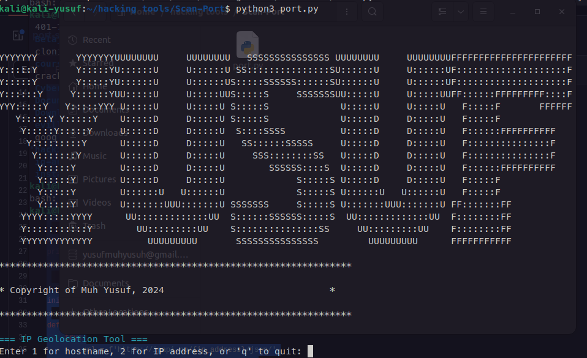
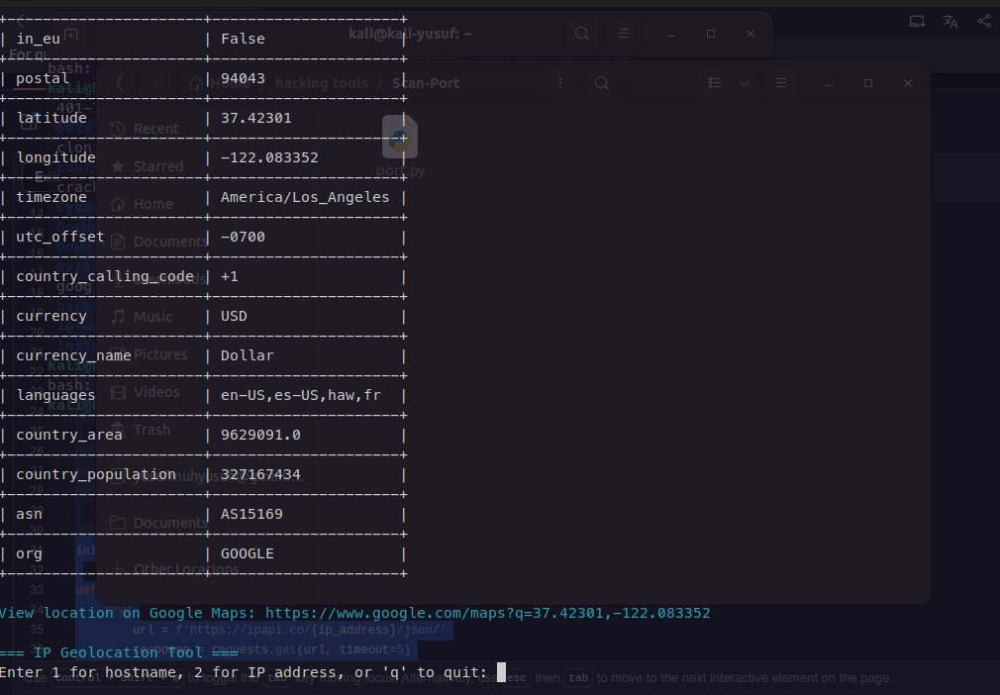

# Alat Geolokasi IP

Alat Python sederhana untuk mencari informasi geografis dari sebuah alamat IP atau hostname.

## Fitur
* **Pencarian Berdasarkan IP atau Hostname:** Cari informasi berdasarkan alamat IP atau nama host.
* **Tampilan Tabel:** Hasil pencarian disajikan dalam format tabel yang rapi.
* **Link ke Google Maps:** Tampilkan lokasi di Google Maps (jika tersedia data lintang dan bujur).
* **Output Berwarna:** Gunakan `colorama` untuk tampilan yang lebih menarik.
* **Penanganan Kesalahan:** Tangani berbagai jenis kesalahan, seperti kesalahan jaringan, input yang tidak valid, dan kesalahan tak terduga.

## Persyaratan
* Python 3.x
* Library `requests` (`pip install requests`)
* Library `tabulate` (`pip install tabulate`)
* Library `colorama` (`pip install colorama`)

## Instalasi
1.clone repository
```bash
git clone https://github.com/yusuf601/port-scan.git
```
2. **Instal Library:**
```bash
   pip install requests tabulate colorama
```
3.run
```bash
python3 scan_port.py
```
## Display




